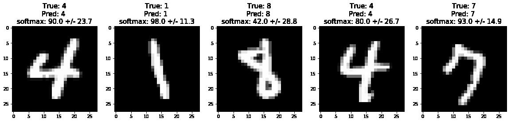

# Probabilistic_MNIST

I strongly believe that getting un uncertainty measure for our Deep Learning models prediction is extremely important for a wide range of application. To give you an example, let's assume we get noisy digits observation, with a traditional model we would still get a number 0-9 as our prediction. With probabilistic modeling, we have also a measure of how uncertain we are in our prediction. This could be used for example to point out the sample to an human annotator, who could solve the issue.

Below an example of how our prediction and confidence level change if we add an increasingly stronger noise to our images, the uncertainty is estimated via a simple but powerful method, [Dropout as Bayesian approximation](https://arxiv.org/pdf/1506.02142.pdf)(Gal, 2016). 

In the example below, we predict the label of the digit 100 times with dropout activated, and then show the mean and the standard deviation of the softmax output. We then add Gaussian Noise to the image and make the predictions again, this time we can notice that the model is less confident in its predictions...

  

